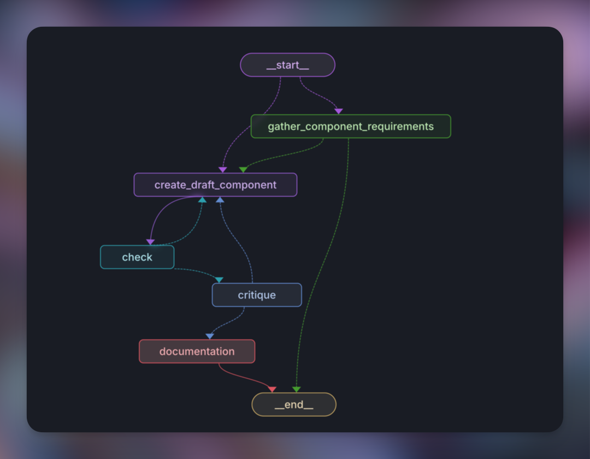

# LangGraph 🦜🕸️ React Component Generator



## Overview

LangGraph React Component Generator is an open-source project that demonstrates the integration of LangChain's LangGraph with LangGraph Studio, LangGraph Cloud, and LangSmith. This project serves as an educational example for developers interested in leveraging these technologies to create intelligent agents for code generation.

This project is inspired by and builds upon the original [LangGraph Engineer](https://github.com/hwchase17/langgraph-engineer) by Harrison Chase [@hwchase17](https://x.com/hwchase17).

## Features

- Generates React components based on user requirements
- Utilizes a multi-step process for component creation:
  1. Gathering component requirements
  2. Drafting the component
  3. Performing programmatic checks
  4. Critiquing the generated code
  5. Creating documentation
- Integrates with various LangChain tools and services

## How It Works

The LangGraph React Component Generator uses a state graph to manage the flow of component creation. Here's a brief overview of the main steps:

1. **Gather Requirements**: The agent interacts with the user to collect detailed requirements for the React component.
2. **Create Draft**: Based on the gathered requirements, a draft of the React component is generated.
3. **Check**: The draft undergoes programmatic checks to ensure it meets basic React component structure and syntax.
4. **Critique**: An AI model reviews the component, focusing on best practices, performance, and adherence to React and Next.js conventions.
5. **Documentation**: If the component passes all checks, comprehensive documentation is generated.

## Key Components

- `agent.py`: Defines the main workflow and state graph for the component generation process.
- `gather_component_requirements.py`: Handles the interaction for collecting component requirements.
- `draft.py`: Generates the initial draft of the React component.
- `check.py`: Performs basic syntax and structure checks on the generated component.
- `critique.py`: Provides an AI-powered review of the component.
- `documentation.py`: Creates detailed documentation for the final component.

## Getting Started

### Prerequisites

- Python 3.9+
- LangChain
- LangGraph

### Installation

1. Clone the repository:
   ```
   git clone https://github.com/GitMaxd/langgraph-react-component-gen.git
   cd langgraph-react-component-gen
   ```

2. Copy .env.example to .env and fill in the OpenAI and Anthropic API Keys
   ```
   cp .env.example .env
   ```

### Usage

You can run this project using different methods:

1. **LangGraph Studio**: 
   Use [LangGraph Studio](https://github.com/langchain-ai/langgraph-studio) for local development and testing.

2. **LangGraph Cloud**: 
   Deploy the project to [LangGraph Cloud](https://langchain-ai.github.io/langgraph/cloud/#overview) for scalable execution.

## Contributing

Contributions are welcome! Please feel free to submit a Pull Request.

## License

This project is open-source and available under the [MIT License](LICENSE).

## Acknowledgements

- Harrison Chase ([@hwchase17](https://x.com/hwchase17)) for the original LangGraph Engineer project
- The entire [LangChain](https://x.com/langChainAI) team for LangGraph, LangGraph Studio, and LangSmith and two years of awesome!

## Contact

Created by [@GitMaxd](https://twitter.com/GitMaxd) - feel free to contact me, [DM's open!](https://dm.new/api) 
